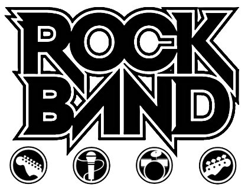
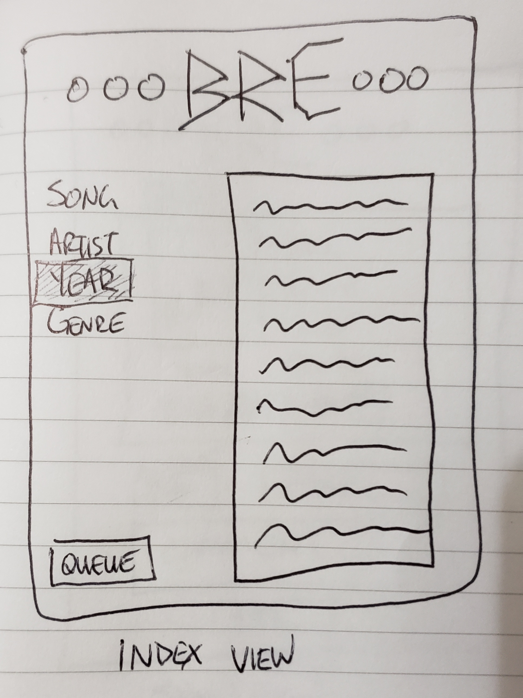
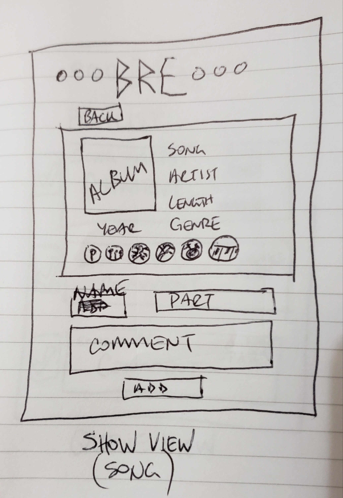
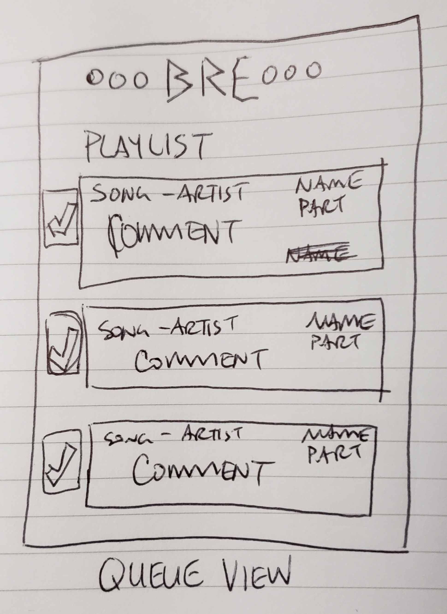
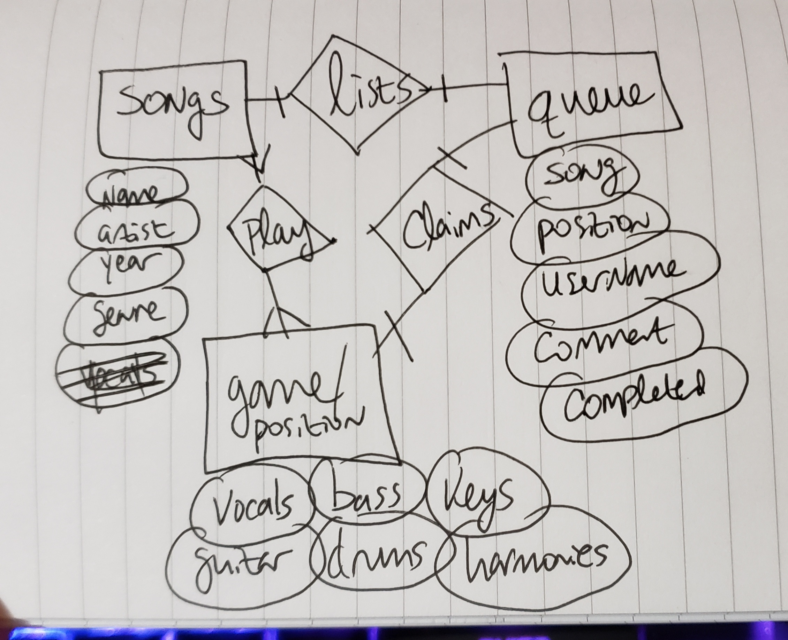

# Big Rock Ending: A Rock Band Party App

Has this happened to you? You're gathered with a group of friends. It's a good time, there may be alcohol, and you decide to play that most wonderous of all video games: ROCK BAND.

Everybody's excited, clamoring to play. The buzz is electric, the excitement real. Your friends begin to browse your song list...

...and browse...

...and keep browsing...

Jesus wept, you have A LOT of songs. Nobody is sure what to pick. The momentum is dying. This night of magic and bangin' tunes teeters on the precipice of disaster. If only there were some way to let people search your library of songs on their own devices and pick the ones they'd like to play without having to subject the entire room to their endless pathetic waffling.

WELL NOW THEY CAN.

Enter, the **Big Rock Ending**, an app that will display your Rock Band songlist in a searchable, sortable format, and allow your friends and future bandmates to choose what they'd like to perform next on your set list. All without holding up gameplay, and without fighting a song search UI that actively hates its users and wishes them harm!

---

## The User Story
As a user...
- I want to see a list of the songs available for play.
- I want to search that list for a specific song I want to play.
- I want to browse that list if I'm unsure which song I want to pick.
- I want to have multiple search and browsing options available to me.
- I want to select the song I want to play and add it to the queue for the evening.
- I want to see the list of songs I and others have picked to play.

---

## The Wireframes

*The main page of the BRE. Songs will be listed on the right-hand side of the page, sorting options on the left.*

*What the user will see when a song is selected. Information such as length and album info will be pulled from MusicBrainz.org's API. The bottom of the song view will be a form the user can fill out to add the song to that evening's setlist.*

*The full list of the songs that each user has selected to play for the evening. It will show the song name and artist, as well as the name of who selected it, the position they want to play, and any comment they felt like leaving. Finally, there's a button on the left-hand side that can be clicked to mark the song as having been played and remove it to keep the setlist easily readable.*

---

## The ERD

*Featuring three models: the song library, the gameplay positions, and the queue/setlist entries. (It could be that I won't need the gameplay portion to be a separate model depending on how I go about this. I'd prefer to keep it to two, but diagrammed for three just in case.)*

---

## MVP

1. A functioning app displaying a full Rock Band library
2. That library is searchable and sortable by:
   1.  song name
   2.  artist
   3.  year
   4.  genre
3. A song view page displaying information about that song, including additional details pulled from MusicBrainz
4. A setlist queue system that:
   1. Displays a list of chosen songs
   2. Including the name and a comment of whoever chose it
   3. Removes the song from the list when marking it played

---

## Stretch goals / v2

1. A more robust setlist that removes the song from the active queue but stores the information for future reference and nerd data, including a running play count. Does my friend Doc always pick "Fancy" by Reba McEntire? Yes, and I want the hard numbers to prove it!

2. Even more information about the songs as pertains to gameplay, like individual instrument difficulty rankings.

3. A front-end way to manage the Rock Band songs. This is going to be my personal song library, so only useful to anyone playing at my house. Ideally, its functionality would be open to all.

