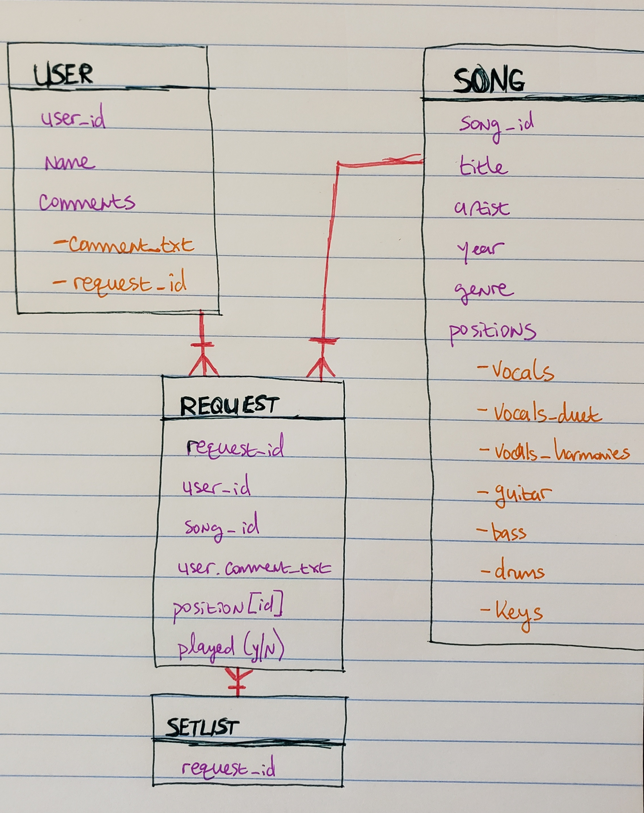
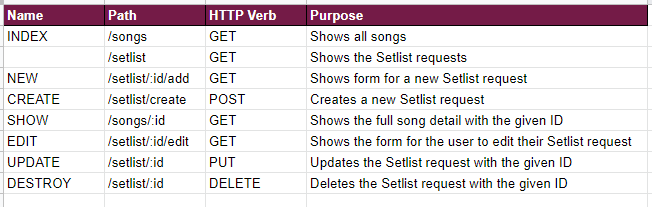

# Big Rock Ending: A Rock Band Party App

Has this happened to you? You're gathered with a group of friends. It's a good time, there may be alcohol, and you decide to play that most wonderous of all video games: ROCK BAND.

Everybody's excited, clamoring to play. The buzz is electric, the excitement real. Your friends begin to browse your song list...

...and browse...

...and keep browsing...

Jesus wept, you have A LOT of songs. Nobody is sure what to pick. The momentum is dying. This night of magic and bangin' tunes teeters on the precipice of disaster. If only there were some way to let people search your library of songs on their own devices and pick the ones they'd like to play without having to subject the entire room to their endless pathetic waffling.

WELL NOW THEY CAN.

Enter, the **Big Rock Ending**, an app that will display your Rock Band songlist in a searchable, sortable format, and allow your friends and future bandmates to choose what they'd like to perform next on your set list. All without holding up gameplay, and without fighting a song search UI that actively hates its users and wishes them harm!

---

## ERD

There are a total of four documents with two sub-documents: **User** (with **Comments**), **Song** (with **Positions**), **Request** and **Setlist**.

At the center is **Request**, which is a collection of information from User and Song (as selected by the user), alongside its own unique ID and the "Played" field which will be a boolean. These requests will themselves be pulled into **Setlist**, which will be rendered to the users as a view, listing songs they and others have requested.

---

## Route Table

---
---

## Technologies Used
* HTML
* CSS
* Javascript
* Node.js
* Express
* Liquid
* MongoDB
* Mongoose

---

## How To Use
It's pretty easy and intuitive! Before doing anything, you'll be required to log in (you'll be prompted to create an account if you haven't yet). Once done, you'll be directed to the main song view where you can sort and browse the available songs by title, artist, year, or genre. When you find a song you like the look of, click the title, and you'll see more information about it, including the playable positions in Rock Band and the album cover where available.

That's the song you want to play? Awesome! Just click the green "Add to Setlist" button and select the position you want to play from the drop-down list. Add a comment if you want, or don't, whatever pleases you, I'm not your mother. When you're all done, click "Add song to setlist", and boom!

If you made a mistake, say you picked bass instead of guitar, just click on your name or "My Requests" in the nav bar, and you'll see everything you've submitted. Just click "Edit", make your changes, and you're all set.

Finally, once you've rocked the hell out of that bad boy, click the "WE ROCKED IT" button to prove it and remove the song from the Setlist.

---
---

## MVP

1. A functioning app displaying a full Rock Band library
2. That library is searchable and sortable by:
   1.  song name
   2.  artist
   3.  year
   4.  genre
3. A song view page displaying information about that song, including additional details pulled from MusicBrainz
4. A setlist queue system that:
   1. Displays a list of chosen songs
   2. Including the name and a comment of whoever chose it
   3. Removes the song from the list when marking it played

---

## Stretch goals / v2

1. A more robust search system that breaks up the songs into categories, has pagination, etc. It's managable right now because there's only a handful of songs, but it'll quickly grow unwieldy with the full library.

2. A direct search, as well. Already know the song title you want to play? Just punch it in!

3. A perpetuating history, where the Setlist information saves for future reference and nerd data, including a running play count. Does my friend Doc always pick "Fancy" by Reba McEntire? Yes, and I want the hard numbers to prove it!

4. Even more information about the songs as pertains to gameplay, like individual instrument difficulty rankings.

5. A front-end way to manage the Rock Band songs. This is going to be my personal song library, so only useful to anyone playing at my house. Ideally, its functionality would be open to all.

6. Cleaner, more efficient code. The song sortings don't need their own views, and there should be a way to modularize the views better too. There are entire blocks of formatting that are straight duplication.
7. 